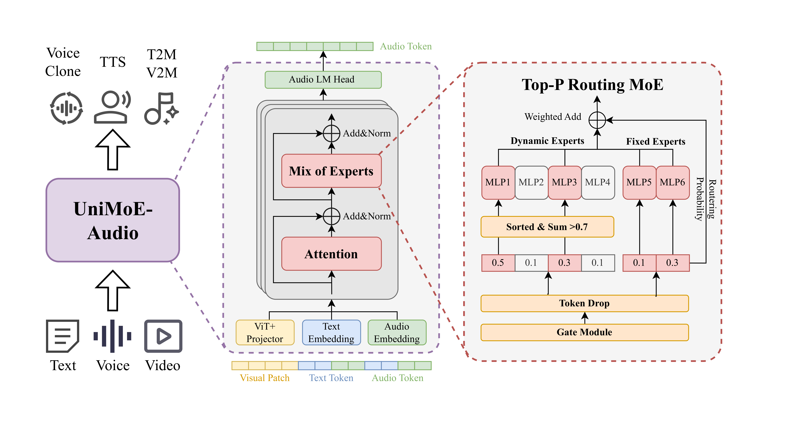

<h1 align="center">UniMoE-Audio: Unified Speech and Music Generation via Dynamic-Capacity Mixture of Experts</h1>

<div align="center" style="display: flex; justify-content: center; margin-top: 10px;">
  <a href="https://mukioxun.github.io/Uni-MoE-site/home.html"></a>
  <a href="docs/UniMoE_Audio-Paper.pdf"></a>
  <a href="https://huggingface.co/foggyforest/UniMoE-Audio-preview"></a>
</div>

<p>
    <strong>UniMoE-Audio</strong> is a unified framework that seamlessly combines speech and music generation. 
    Powered by a novel <strong>dynamic-capacity Mixture-of-Experts</strong> design, it adapts intelligently to input complexity, 
    enabling high-fidelity voice and expressive music within a single model.
</p>
<p>
    UniMoE-Audio introduces <strong>a dynamic-capacity routing mechanism</strong> based on Top-P sampling for adaptive expert allocation, 
    together with a hybrid expert design that separates domain-specific computation (dynamic experts) from universal representations (shared experts). 
    To address data imbalance and task conflicts, UniMoE-Audio adopts a structured three-stage training curriculum. 
    From <strong>voice cloning</strong> and <strong>text-to-speech (TTS)</strong> to <strong>text-to-music (T2M)</strong> and <strong>video-text-to-music (VT2M)</strong>, 
    UniMoE-Audio supports diverse creative workflows. 
    Extensive experiments confirm its state-of-the-art performance and superior cross-task synergy, paving the way toward <strong>universal audio generation</strong>.
</p>


<div align="center">
<strong>Fig. 1</strong> Performance of UniMoE-Audio
</div>

Here is a short video below for an overview of our model and some showcases via TTS, T2M and VT2M:

<video src="assets/intro_video/UniMoE-Audio_repo.mp4" type="video/mp4" width="80%" controls>
</video>

# Installation
The following instructions are for Linux installation.

### 1. Clone this repository and navigate to the UniMoE Audio folder
```bash
git clone https://github.com/foggy-frost-forest/UniMoE-Audio.git
cd UniMoE-Audio 
```

### 2. Set up environment
We recommend using conda to install the environment.
```bash
conda env create -f configs/enviroment.yml      # add -n for your name
conda activate unimoe-audio                     # default name
```
then install the torch packages
  ```bash
   # Use the official index
   pip install torch==2.1.1 torchvision==0.16.1 torchaudio==2.1.1 --index-url https://download.pytorch.org/whl/cu121
   
   # Use Tsinghua mirror source
   pip install torch==2.1.1 torchvision==0.16.1 torchaudio==2.1.1 -i https://pypi.tuna.tsinghua.edu.cn/simple/ --extra-index-url https://download.pytorch.org/whl/cu121
   
   # Use Alibaba Cloud mirror source
   pip install torch==2.1.1 torchvision==0.16.1 torchaudio==2.1.1 -i https://mirrors.aliyun.com/pypi/simple/ --extra-index-url https://download.pytorch.org/whl/cu121
   ```
A `dac model` is also required to be downloaded in '/path/to/UniMoE-Audio/utils/dac_model'.
It will be automatically downloaded when running the first time.

## UniMoE Audio Weights
`All weights` should be downloaded to ensure use.
After downloading all of them, organize the weights as follows in '/path/to/UniMoE-Audio-preview' folder:
```
models
└── UniMoE_Audio-preview
    ├──added_tokens.json
    ├──model.safetensors.index.json
    ├──config.json
    ├──special_tokens_map.json
    ├──merges.txt
    ├──tokenizer_config.json
    ├──trainer_state.json
    ├──video_preprocessor_config.json
    ├──vocab.json
    ├── model-00001-of-00003.safetensors
    ├── model-00002-of-00003.safetensors
    └── model-00003-of-00003.safetensors
```
## How to infer and deploy your demo

### 1.Make sure that all the weights are downloaded and the running environment is set correctly.

### 2.Run inference scripts:

`inference.py`: Simplified inference function for quick single-task calls.
```bash
conda activate unimoe-audio
cd examples

# Generate music
python inference.py --task text_to_music --input "A peaceful piano melody" --output ./music_output --model /path/to/your/model

# Voice cloning
python inference.py --task text_to_speech --input "Hello world" --ref-audio ref.wav --ref-text "Reference text" --output ./speech_output --model /path/to/your/model

# Video-to-music generation
python inference.py --task video_text_to_music --input "Upbeat electronic music" --video ./video.mp4 --output ./video_music_output --model /path/to/your/model
```

`inference_framework.py`: Complete batch processing framework with configuration files.
```bash
cd path/to/UniMoE-Audio
conda activate unimoe-audio
python inference_framework.py --config test_config.json --tasks test_tasks.json --output-results results.json
```
Details about json files can be found in the [examples/README.md](examples/README.md)

### To launch the online demo, run the following command:
Firstly, please install the web dependencies:
```bash
cd path/to/UniMoE-Audio
conda activate unimoe-audio
pip install -r configs/requirements_web.txt
```
```bash
python web_demo.py --model /path/to/your/model
```

## Technical Details:


<div align="center">
<em>Left: Unified architecture for multimodal speech/music generation.<br>
Right: Top-P routing for token-based dynamic expert allocation.</em>

<strong>Fig. 2</strong> UniMoE-Audio Structure
</div>

### Key Innovations

#### **Top-P Dynamic Routing Strategy**
We introduce a **Top-P routing strategy** that overcomes the limitations of conventional static Top-K routing:

- **Dynamic Expert Allocation**: Instead of assigning a fixed number of experts to every token, our approach dynamically determines the number of experts based on token complexity
- **Resource Efficiency**: Simple tokens don't consume unnecessary resources, while complex tokens receive sufficient processing power
- **Performance Optimization**: Results in improved overall efficiency and performance

#### **Three-Stage Training Curriculum**
We employ a comprehensive training approach to enable effective joint learning from imbalanced data:

1. **Independent Specialist Training** - Initial expert specialization
2. **Integration with Warm-up** - Gradual system integration  
3. **Synergistic Joint Training** - Collaborative optimization

This curriculum successfully overcomes the challenges of data imbalance and task conflict.

> **For detailed technical information, please refer to our [📄 research paper](docs/UniMoE_Audio-Paper.pdf)**
