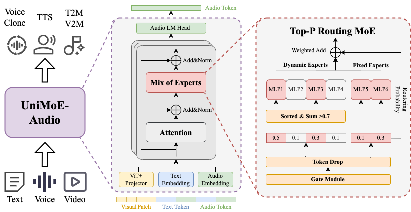
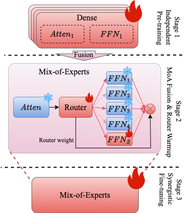

<!-- <p align="center">
    
<p> -->
<!-- <h2 align="center"> <a href="https://github.com/HITsz-TMG/UMOE-Scaling-Unified-Multimodal-LLMs/">Uni-MoE: Scaling Unified Multimodal LLMs with Mixture of Experts</a></h2> -->
<!-- <h5 align="center"> If you appreciate our project, please consider giving us a star ⭐ on GitHub to stay updated with the latest developments.  </h2>

<h4 align="center"> -->

# Welcome to the repo of **UniMOE Audio**!

### UniMoE Audio is an end-to-end large audio model for unified multimodal audio generation

<!-- [](https://huggingface.co/foggyforest/UniMoE-Audio-preview)
[]()
[]() 
[]() -->


## News

- [9/10] 🔥 We released **UniMoE_Audio-preview**. Check out the [paper]() and [demo]().


## Performance show

| Prompt | Audio |
|:--:|:--:|
| This song contains several drum hits and percussive instruments playing a fast paced rhythm that motivates dancing along. An e-bass is bringing the low end supporting the drums. Cuatro guitars are strumming chords as a rhythmic addition. Trumpets are playing a loud and catchy melody. Some of the musical elements are slightly panned to the left and right side of the speakers. This song may be playing at a cheerful event. | [Play](https://raw.githubusercontent.com/foggy-frost-forest/UniMoE-Audio/main/assets/audios/1j4rFfU5XKQ.mp3) |
| This song contains a digital drum playing a simple pattern with a kick and a snare sound. Synthesizers are playing a repeating melody in the higher register. Another synth sound is playing a more aggressive lead sound with a countermelody. A string sample is being used to create a short hit. This song may be playing during a car ride.| [Play](https://raw.githubusercontent.com/foggy-frost-forest/UniMoE-Audio/main/assets/audios/2UY_-oF1vqo.mp3) |
| This is a four on the floor style of production. The song is a drum and bass type of song with a bright and fuzzy synth to add a melodic element. The first part of the song feels suspenseful. | [Play](https://raw.githubusercontent.com/foggy-frost-forest/UniMoE-Audio/main/assets/audios/c_a74UO2ftg.mp3) |
| This is a rock music piece. There is a medium-to-high pitched electric guitar solo at the forefront. In the melodic background, a keyboard and a bass guitar repeating the same pattern can be heard. The acoustic drums are playing a loud and slightly fast-paced rock drum beat. There is a rebellious atmosphere to this piece. It can be used in the soundtrack of a teenage drama or a crime shootout video game.| [Play](https://raw.githubusercontent.com/foggy-frost-forest/UniMoE-Audio/main/assets/audios/C1M5xqDQW58.mp3) |
|||

## Structure

We introduce the Mix-of-ALL architecture—an end-to-end universal audio generation model capable of unified multimodal audio synthesis. The system incorporates several key innovations:

- Adaptive Computation Allocation: A routing mechanism dynamically selects the number of activated experts based on the uncertainty estimated per audio frame, enabling computation that adapts to varying information density and prediction difficulty.
- Multi-Granularity Expert Design: We deploy both dynamic and static experts. Dynamic experts are activated on-demand for task-specific processing, while static experts remain consistently active for general computation, achieving an optimal balance between performance and efficiency.
- Mixture-of-Attention Architecture: By introducing dynamic activation strategies into the attention modules, the model selectively activates attention heads, significantly expanding the parameter activation space and unlocking greater potential.

Together, these advances form a powerful and efficient framework for high-quality, flexible audio generation across multiple modalities. The model architecture and training pipeline are shown in the figures below:

|   |   |
|:--:|:--:|
|  |  |
| UniMoE Audio Model Architecture | UniMoE Audio Training Pipeline |

## Installation
The following instructions are for Linux installation.

### 1. Clone this repository and navigate to the UniMoE Audio folder
```bash
git clone https://github.com/foggy-frost-forest/UniMoE-Audio.git
cd UniMoE-Audio 
```

### 2. Set up environment
We recommend using conda to install the environment.
```bash
conda env create -f configs/enviroment.yml      # add -n for your name
conda activate unimoe-audio                     # default name
```

## UniMoE Audio Weights
All weights should be downloaded to ensure use.
After downloading all of them, organize the weights as follows in './models/UniMoE_Audio-preview' folder:
```
models
└── UniMoE_Audio-preview
    ├── model-00001-of-00003.safetensors
    ├── model-00002-of-00003.safetensors
    └── model-00003-of-00003.safetensors
```

## How to infer and deploy your demo

### 1.Make sure that all the weights are downloaded and the running environment is set correctly.

### 2.Run inference scripts:

`inference.py`: Simplified inference function for quick single-task calls.
```bash
cd path/to/UniMoE-Audio/examples
conda activate unimoe-audio
# Music Generating
python inference.py --task text_to_music --input "Caption about music" --output ./music_output --model /path/to/your/model

# Voice Cloning / TTS
python inference.py --task text_to_speech --input "Input text" --ref-audio ref.mp3 --ref-text "Reference text" --output ./speech_output --model /path/to/your/model
```

`inference_framework.py`: Complete batch processing framework with configuration files.
```bash
cd path/to/UniMoE-Audio/examples
conda activate unimoe-audio
python inference_framework.py --config config.json --tasks tasks.json --output-results results.json
```
Details can be found in the [examples/README.md](examples/README.md)

### To launch the online demo, run the following command:
```bash
python web_demo.py --model ./models/UniMoE_Audio-preview
```

<!-- ## How to evaluate on datasets
Evaluate the model on the datasets using the following command:
```bash

``` -->
